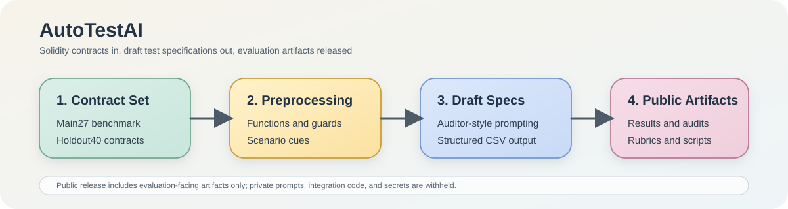

# AutoTestAI Public Artifact Repository

This repository provides public artifact materials accompanying the published
AutoTestAI paper. It releases selected evaluation-facing summaries and
supporting files to improve transparency of the reported results while keeping
security-sensitive implementation details and private integration assets out of
scope for the public release.

The public package includes:

- an anonymized contract catalog for the 67-contract evaluation corpus, with a
  small number of low-risk public labels for illustration
- dataset-level summary statistics
- released baseline and ablation result tables
- executability summary tables
- hallucination summary tables
- lightweight evaluation scripts for reading released artifact files
- a concise human-evaluation rubric
- human-evaluation aggregate summary
- a synthetic illustrative sample artifact

It does not include:

- API keys or provider credentials
- the LLM invocation backend
- the prompt-engineering and generation pipeline
- redistributed third-party Solidity source trees
- original contract names and repository paths for the released catalog
- row-level audit annotations, raw expert ratings, or end-to-end prompt traces

## Repository Layout

- `data/dataset/`: anonymized contract catalog and split-level dataset summaries
- `data/baselines/`: released baseline and ablation result tables
- `data/executability/`: aggregate executability results and failure taxonomy
- `data/hallucination/`: aggregate hallucination summaries
- `data/examples/`: synthetic illustrative sample artifact
- `data/examples/end_to_end_mini/`: a compact illustrative mini example of the
  public artifact format
- `data/human_evaluation/`: aggregate human-evaluation summary
- `evaluation/`: concise public-facing human-evaluation rubric
- `scripts/`: lightweight scripts for reading the released summary files
- `assets/`: lightweight visual asset used in the repository page

## Scope

This repository is intended to:

- document the main aggregate evaluation outcomes reported in the paper
- provide a public record of released summary statistics and supporting
  evaluation artifacts
- improve transparency around dataset composition, baseline comparisons,
  executability analysis, hallucination analysis, and human-evaluation
  outcomes
- reduce disclosure of project-specific intermediate data and security-sensitive
  integration details

## Notes

- The released catalog is anonymized and binned; it is intended for public
  transparency while limiting unnecessary exposure of project-specific details.
- A small number of low-risk public labels are provided in the catalog to make
  the released artifact easier to read; the rest of the corpus remains
  anonymized.
- The released baseline files are result tables only; they do not include the
  row-level raw annotations used during internal experimentation.
- The released scripts read the public artifact files included in this
  repository.
- The illustrative sample artifact is synthetic and is not a row copied from
  the paper's internal evaluation corpus.
- The mini end-to-end example is provided only to illustrate public artifact
  formatting at a very small scale; it is not a direct dump of the internal
  experimental workflow.
- No secret, personal, or provider credential is shipped in this repository.

## License

This project is licensed under the MIT License.
